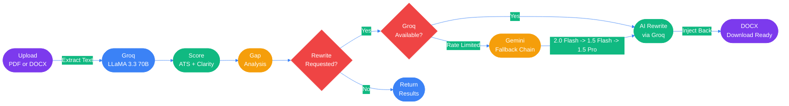

<div align="center">


<br>

[](https://github.com/mananjani2102)

<br>

<p align="center">
  <a href="https://github.com/mananjani2102">
    
  </a>
  &nbsp;
  
  &nbsp;
  
  &nbsp;
  
</p>

<br>


</div>

<br>

<div align="center">

## The Problem with Resume Tools Today

</div>

```
  ✗  They give you a number — not a direction
  ✗  They flag keywords — but won't fix your writing
  ✗  They destroy your formatting when they "improve" your resume
  ✗  One AI model fails — the whole thing breaks

  ✔  Nexus AI scores, rewrites, preserves, and downloads — end to end
```

<div align="center">

<br>

<table>
<tr>
<td align="center" width="50%">

### Every Other Tool


</td>
<td align="center" width="50%">

### Nexus AI


</td>
</tr>
</table>

<br>


</div>

<br>

<div align="center">

## Feature Showcase

</div>

<div align="center">
<table>
<tr>
<td align="center" width="25%">


### Resume Analysis
Score your resume across **ATS compatibility**, **clarity**, and **overall quality** in under 10 seconds. Powered by Groq LLaMA 3.3 70B.


</td>
<td align="center" width="25%">


### AI Full Rewrite
Your resume fully rewritten with strong action verbs and quantified results. The original layout, fonts, and colors stay **100% untouched**.


</td>
<td align="center" width="25%">


### Bullet Improver
Paste any weak bullet point. Get a **STAR-method** impact statement back with Situation, Task, Action, and measurable Result.


</td>
<td align="center" width="25%">


### Interview Prep
5 personalized interview questions generated directly from your resume's **strengths, gaps, and target role**. No generic questions.


</td>
</tr>
<tr>
<td align="center" width="25%">


### ATS Keyword Gap
Identifies the **exact keywords missing** from your resume relative to the target job role. Know precisely what recruiters' systems are filtering you out for.


</td>
<td align="center" width="25%">


### DOCX Download
The AI-improved resume is available for **direct `.docx` download** — not a screenshot, not a PDF print, a real editable Word file with all your original formatting.


</td>
<td align="center" width="25%">


### Smart Fallback Chain
If Groq hits its rate limit, the backend **automatically switches** to Gemini 2.0 Flash → 1.5 Flash → 1.5 Pro. You never see a failure.


</td>
<td align="center" width="25%">


### Secure Auth
JWT-based login with bcrypt password hashing. Optional Firebase Auth integration for Google sign-in. Session persists with a **7-day token**.


</td>
</tr>
</table>
</div>

<br>

<div align="center">

</div>

<br>

<div align="center">

## Tech Stack

</div>

<div align="center">

### Frontend


<br><br>

<table>
<tr>
<th align="center">Layer</th>
<th align="center">Technology</th>
<th align="left">What it does in Nexus AI</th>
</tr>
<tr>
<td align="center"></td>
<td align="center"><strong>React 18 + Vite</strong></td>
<td>Component-based UI with Vite's instant HMR and sub-second cold starts</td>
</tr>
<tr>
<td align="center"></td>
<td align="center"><strong>React Router v6</strong></td>
<td>Declarative client-side routing across 8 pages</td>
</tr>
<tr>
<td align="center"></td>
<td align="center"><strong>Framer Motion</strong></td>
<td>Page transitions, stagger reveals, and micro-interaction animations</td>
</tr>
<tr>
<td align="center"></td>
<td align="center"><strong>Axios</strong></td>
<td>Centralized API client with 90s timeout for AI inference calls</td>
</tr>
<tr>
<td align="center"></td>
<td align="center"><strong>Firebase Auth</strong></td>
<td>Optional social and email auth — layered on top of JWT</td>
</tr>
<tr>
<td align="center"></td>
<td align="center"><strong>CSS Modules</strong></td>
<td>Scoped component styles — no class name conflicts at scale</td>
</tr>
</table>

<br>

### Backend


<br><br>

<table>
<tr>
<th align="center">Layer</th>
<th align="center">Technology</th>
<th align="left">What it does in Nexus AI</th>
</tr>
<tr>
<td align="center"></td>
<td align="center"><strong>Node.js + Express</strong></td>
<td>REST API server with global error handler and 50MB body limit for file uploads</td>
</tr>
<tr>
<td align="center"></td>
<td align="center"><strong>MongoDB + Mongoose</strong></td>
<td>Stores users and analysis history with typed schemas and validation</td>
</tr>
<tr>
<td align="center"></td>
<td align="center"><strong>Groq SDK — LLaMA 3.3 70B</strong></td>
<td>Ultra-fast inference for scoring, rewriting, bullets, and interview questions</td>
</tr>
<tr>
<td align="center"></td>
<td align="center"><strong>Google Gemini (2.0 → 1.5)</strong></td>
<td>3-model fallback chain triggered automatically when Groq is unavailable</td>
</tr>
<tr>
<td align="center"></td>
<td align="center"><strong>Multer</strong></td>
<td>In-memory file handling for PDF and DOCX resume uploads</td>
</tr>
<tr>
<td align="center"></td>
<td align="center"><strong>pdf-parse</strong></td>
<td>Extracts raw text from uploaded PDF resumes for AI processing</td>
</tr>
<tr>
<td align="center"></td>
<td align="center"><strong>Mammoth</strong></td>
<td>Converts DOCX to plain text and fallback HTML for AI consumption</td>
</tr>
<tr>
<td align="center"></td>
<td align="center"><strong>JSZip + xml2js</strong></td>
<td>Custom parser that preserves fonts, colors, and layout during rewrite</td>
</tr>
<tr>
<td align="center"></td>
<td align="center"><strong>bcryptjs + jsonwebtoken</strong></td>
<td>Password hashing at cost 10 and 7-day signed JWT tokens</td>
</tr>
<tr>
<td align="center"></td>
<td align="center"><strong>dotenv</strong></td>
<td>Loads environment variables from `.env` at server startup</td>
</tr>
</table>

</div>

<br>

<div align="center">

</div>

<br>

<div align="center">

## AI Pipeline



<br>


</div>

<br>

<div align="center">

</div>

<br>

<div align="center">

## Project Structure

</div>

```
nexus-ai/
|
+-- backend/                           <- Node.js + Express REST API
|   |
|   +-- models/
|   |   +-- User.js                    <- name · email · bcrypt password
|   |   +-- History.js                 <- filename · scores · keywords · date
|   |
|   +-- routes/
|   |   +-- auth.js                    <- POST /signup  |  POST /login
|   |   +-- analyze.js                 <- POST /analyze — PDF/DOCX -> AI scoring
|   |   +-- bullet.js                  <- POST /improve-bullet — STAR rewrite
|   |   +-- interview.js               <- POST /interview-questions — tailored Q&A
|   |   +-- rewrite.js                 <- POST /rewrite-resume — full Groq/Gemini rewrite
|   |   +-- history.js                 <- GET  /history — last 20 analyses
|   |
|   +-- utils/
|   |   +-- docxStore.js               <- In-memory buffer keyed by UUID
|   |   +-- docxStyleExtractor.js      <- JSZip+xml2js -> styled HTML (preserves layout)
|   |   +-- docxTextReplacer.js        <- Injects AI text into raw DOCX XML
|   |   +-- htmlTextMapper.js          <- Numbered text-map extraction & re-injection
|   |
|   +-- .env.example                   <- Template for required environment variables
|   +-- .gitignore
|   +-- package.json
|   +-- server.js                      <- Express entry · MongoDB connect · global handler
|
+-- src/                               <- React 18 + Vite Frontend
    |
    +-- assets/                        <- Brand images · hero backgrounds · logo
    |
    +-- components/
    |   +-- BrandIntro.jsx             <- Animated brand splash on first load
    |   +-- DemoVideoPlayer.jsx        <- Embedded demo player on landing page
    |   +-- ErrorBanner.jsx            <- Global error display banner
    |   +-- LoginModal.jsx             <- Modal-based login flow
    |   +-- Modal.jsx                  <- Reusable base modal component
    |   +-- Navbar.jsx                 <- Responsive top navigation bar
    |   +-- PageWrapper.jsx            <- Framer Motion route-level wrapper
    |   +-- ScoreRing.jsx              <- Animated circular score indicator
    |
    +-- config/
    |   +-- firebase.js               <- Firebase app init + getAuth export
    |
    +-- context/
    |   +-- AuthContext.jsx           <- JWT decode · login · logout · user state
    |   +-- ResumeContext.jsx          <- Global resume + analysis state
    |
    +-- pages/
    |   +-- LandingPage.jsx            <- Hero · features · CTA · demo video
    |   +-- LoginPage.jsx              <- Login form with validation
    |   +-- RegisterPage.jsx           <- Registration form
    |   +-- UploadPage.jsx             <- Drag-and-drop resume upload + role input
    |   +-- DashboardPage.jsx          <- Score rings · strengths · weakness cards
    |   +-- SuggestionsPage.jsx        <- AI suggestions · full rewrite · download
    |   +-- BulletImproverPage.jsx     <- STAR bullet tool standalone
    |   +-- HistoryPage.jsx            <- Past analysis cards with scores
    |
    +-- services/
    |   +-- api.js                     <- Axios instance · all 5 API call functions
    |
    +-- App.jsx                        <- BrowserRouter · AnimatePresence · routes
    +-- main.jsx                       <- ReactDOM.createRoot entry point
    +-- App.css                        <- Global layout styles
    +-- index.css                      <- CSS variables · resets · typography
    +-- resume-preview.css             <- Styles for inline DOCX HTML preview
```

<br>

<div align="center">

</div>

<br>

<div align="center">

## Getting Started

<table>
<tr>
<td>

```
╔══════════════════════════════════════════════════════════════════╗
║                                                                  ║
║   ┌──────────────────────────────────────────────────────────┐   ║
║   │  TERMINAL                                          ● ● ● │   ║
║   ├──────────────────────────────────────────────────────────┤   ║
║   │                                                          │   ║
║   │  $ git clone github.com/mananjani2102/nexus-ai           │   ║
║   │  Cloning into 'nexus-ai'... done.                        │   ║
║   │                                                          │   ║
║   │  $ cd nexus-ai/backend && npm install                    │   ║
║   │  added 187 packages in 8s                                │   ║
║   │                                                          │   ║
║   │  $ cp .env.example .env                                  │   ║
║   │  # open .env and paste your API keys                     │   ║
║   │                                                          │   ║
║   │  $ npm run dev                                           │   ║
║   │  + MongoDB connected                                     │   ║
║   │  + Server running on http://localhost:4000               │   ║
║   │                                                          │   ║
║   │  $ cd .. && npm install && npm run dev                   │   ║
║   │  + Frontend running on http://localhost:5173             │   ║
║   │                                                          │   ║
║   │  Nexus AI is live. Go build your career.                 │   ║
║   │                                                          │   ║
║   └──────────────────────────────────────────────────────────┘   ║
║                                                                  ║
╚══════════════════════════════════════════════════════════════════╝
```

</td>
</tr>
</table>

</div>

### Prerequisites


### 1 — Clone

```bash
git clone https://github.com/mananjani2102/nexus-ai.git
cd nexus-ai
```

### 2 — Backend

```bash
cd backend
npm install
cp .env.example .env        # fill in MONGODB_URI, JWT_SECRET, GROQ_API_KEY
npm run dev                 # → http://localhost:4000
```

### 3 — Frontend

```bash
cd ..
npm install
```

Create `.env` at project root:

```env
VITE_API_URL=http://localhost:4000/api

# Optional — Firebase Social Auth
VITE_FIREBASE_API_KEY=
VITE_FIREBASE_AUTH_DOMAIN=
VITE_FIREBASE_PROJECT_ID=
VITE_FIREBASE_STORAGE_BUCKET=
VITE_FIREBASE_MESSAGING_SENDER_ID=
VITE_FIREBASE_APP_ID=
```

```bash
npm run dev                 # → http://localhost:5173
```

<br>

<div align="center">

</div>

<br>

<div align="center">

## Environment Variables

</div>

<div align="center">

### `backend/.env`

| Variable | Required | Description |
|:---|:---:|:---|
| `MONGODB_URI` | **Yes** | Full MongoDB Atlas connection string |
| `JWT_SECRET` | **Yes** | Random string used to sign JWT tokens (min 32 chars) |
| `GROQ_API_KEY` | **Yes** | Groq API key — primary AI inference engine |
| `GEMINI_API_KEY` | Optional | Google AI Studio key — activates the fallback chain |
| `PORT` | Optional | HTTP port for Express (default `4000`) |

<br>

### `.env` — Frontend Root

| Variable | Required | Description |
|:---|:---:|:---|
| `VITE_API_URL` | **Yes** | Backend base URL including `/api` |
| `VITE_FIREBASE_API_KEY` | Optional | Firebase project API key |
| `VITE_FIREBASE_AUTH_DOMAIN` | Optional | Firebase auth domain |
| `VITE_FIREBASE_PROJECT_ID` | Optional | Firebase project ID |
| `VITE_FIREBASE_STORAGE_BUCKET` | Optional | Firebase storage bucket |
| `VITE_FIREBASE_MESSAGING_SENDER_ID` | Optional | Firebase messaging sender ID |
| `VITE_FIREBASE_APP_ID` | Optional | Firebase app ID |

</div>

<br>

<div align="center">

</div>

<br>

<div align="center">

## API Reference


<br><br>

| Method | Endpoint | Auth | Description |
|:---:|:---|:---:|:---|
| `POST` | `/auth/signup` | — | Register new user, returns JWT |
| `POST` | `/auth/login` | — | Authenticate user, returns JWT |
| `POST` | `/analyze` | — | Upload PDF/DOCX → AI scores and analysis |
| `POST` | `/improve-bullet` | — | Single bullet → STAR-method rewrite |
| `POST` | `/interview-questions` | — | Generate 5 role-tailored interview questions |
| `POST` | `/rewrite-resume` | — | Full AI rewrite → returns HTML + DOCX base64 |
| `GET` | `/history` | — | Returns last 20 analyses sorted by date |

</div>

<br>

### POST `/auth/signup`

```json
// Request
{ "name": "Manan Jani", "email": "manan@example.com", "password": "strongPass123" }

// Response 201
{ "token": "eyJhbGciOiJIUzI1NiJ9...", "user": { "name": "Manan Jani", "email": "manan@example.com" } }
```

### POST `/analyze` — `multipart/form-data`

| Field | Type | Required | Detail |
|:---|:---|:---:|:---|
| `resume` | `File` | **Yes** | `.pdf` or `.docx` only |
| `jobRole` | `String` | No | Default: `Software Engineer` |
| `jobDescription` | `String` | No | Paste JD for deeper keyword matching |

```json
// Response 200
{
  "overall_score": 74,  "ats_score": 68,  "clarity_score": 80,
  "strengths": ["Clear work experience", "Education present", "Contact complete", "Skills section clean"],
  "weaknesses": ["Missing metrics", "Weak verbs", "No summary", "ATS keywords thin"],
  "ats_keywords_missing": ["agile", "CI/CD", "scalable", "REST API", "leadership"],
  "star_bullets": { "Worked on backend": "Engineered 3 Node.js microservices, reducing API latency by 40%" },
  "resumeText": "...",  "resumeHtml": "<div>...</div>",
  "resumeFormat": "docx",  "docxId": "a1b2c3d4"
}
```

### POST `/improve-bullet`

```json
// Request
{ "bullet": "Worked on fixing bugs in the payment module", "jobRole": "Backend Engineer" }

// Response 200
{
  "improved": "Resolved 30+ critical payment defects, cutting transaction failure rate by 25%",
  "metrics": {
    "situation": "Payment module had recurring production bugs",
    "task": "Triage and resolve critical defects under deadline",
    "action": "Root-cause analysis + unit test coverage per fix",
    "result": "25% drop in failed transactions, zero regressions"
  }
}
```

### POST `/interview-questions`

```json
// Request
{ "jobRole": "Backend Engineer", "strengths": ["System design"], "weaknesses": ["Cloud gaps"], "ats_keywords_missing": ["Docker", "CI/CD"] }

// Response 200
{ "questions": [ "Walk me through a system you designed end-to-end.", "How have you used Docker in production?", "..." ] }
```

### POST `/rewrite-resume`

```json
// Response 200
{
  "rewritten": "<div>...AI-improved HTML with original styles...</div>",
  "docxBase64": "UEsDBBQABgAIAAAAIQ...",
  "changes": [{ "original": "Worked on backend", "improved": "Engineered scalable backend with 99.9% uptime" }]
}
```

### GET `/history`

```json
// Response 200
[{ "_id": "665f...", "filename": "manan_resume.pdf", "job_role": "SWE", "overall_score": 74, "ats_score": 68, "clarity_score": 80, "keywords_missing": ["CI/CD"], "date": "2026-04-03T09:44:00Z" }]
```

<br>

<div align="center">

</div>

<br>

<div align="center">

## Error Handling

All endpoints return a consistent error envelope:

```json
{ "error": "Human-readable description of what went wrong" }
```

| Status | When It Fires |
|:---:|:---|
| `400` | Missing file · unsupported format · empty body · validation failure |
| `401` | Wrong email or password on `/login` |
| `500` | Unhandled server exception — caught by global Express error handler |
| `503` | Groq **and** all 3 Gemini fallback models are simultaneously rate-limited |

</div>

Every AI route has its own `try/catch` with a hardcoded safe fallback — if the LLM returns malformed JSON, the app parses what it can and fills the rest with sensible defaults. Users never see a blank screen.

<br>

<div align="center">

</div>

<br>

<div align="center">

## Deployment


&nbsp;

&nbsp;


</div>

<br>

**Backend → Render**

1. Push `backend/` to a GitHub repository.
2. Create a **Web Service** on [render.com](https://render.com).
3. Build Command: `npm install` — Start Command: `npm start`
4. Add all backend environment variables under **Environment** in the dashboard.
5. Deploy. Your public URL: `https://nexus-ai-backend.onrender.com`

**Frontend → Vercel**

1. Push the project root to GitHub.
2. Import on [vercel.com](https://vercel.com) — Framework: **Vite**
3. Add all frontend environment variables.
4. Set `VITE_API_URL` = `https://nexus-ai-backend.onrender.com/api`
5. Deploy.

> `docxStore.js` holds DOCX buffers in-memory. They clear on server restart. For production persistence, migrate to **Redis** or **AWS S3**.

<br>

<div align="center">

</div>

<br>

<div align="center">

## Roadmap

<table>
<tr>
<th align="center">Priority</th>
<th align="left">Feature</th>
<th align="left">Description</th>
</tr>
<tr>
<td align="center"></td>
<td><strong>Persistent DOCX Storage</strong></td>
<td>Replace in-memory store with AWS S3 / Cloudinary for cross-restart persistence</td>
</tr>
<tr>
<td align="center"></td>
<td><strong>User-linked History</strong></td>
<td>Tie every analysis record to the authenticated user's account</td>
</tr>
<tr>
<td align="center"></td>
<td><strong>Rate Limiting</strong></td>
<td>Per-IP throttling via <code>express-rate-limit</code> to protect AI endpoints</td>
</tr>
<tr>
<td align="center"></td>
<td><strong>Cover Letter Generator</strong></td>
<td>AI-generated cover letter from resume content + job description</td>
</tr>
<tr>
<td align="center"></td>
<td><strong>LinkedIn URL Input</strong></td>
<td>Accept a LinkedIn profile URL as an alternative to file upload</td>
</tr>
<tr>
<td align="center"></td>
<td><strong>PDF Download</strong></td>
<td>Export the AI-improved resume directly as a formatted PDF</td>
</tr>
<tr>
<td align="center"></td>
<td><strong>WebSocket Score Streaming</strong></td>
<td>Real-time ATS score updates streamed during resume upload</td>
</tr>
<tr>
<td align="center"></td>
<td><strong>Multi-language Support</strong></td>
<td>Detect resume language and run analysis in the same language</td>
</tr>
</table>

</div>

<br>

<div align="center">

</div>

<br>

## Contributing

1. Fork the repository and create your branch: `git checkout -b feature/your-feature`
2. Make your changes with clean, descriptive commits: `git commit -m "feat: add LinkedIn URL input"`
3. Push to your fork: `git push origin feature/your-feature`
4. Open a Pull Request against `main` — describe what changed and why.

All new route handlers must include `try/catch` error handling. Follow the existing pattern in `routes/`.

<br>

## License

This project is licensed under the [MIT License](LICENSE). Use it, fork it, ship it.

<br>

<div align="center">


<br>

## The Builder

<br>


<br>

### Manan Jani

*Full-stack developer who believes your resume should work as hard as you do.*

<br>

<a href="https://github.com/mananjani2102">
  
</a>
&nbsp;
<a href="https://www.linkedin.com/in/mananjani2102/">
  
</a>
&nbsp;
<a href="https://x.com/Mananjani2102">
  
</a>

<br><br>

[](https://github.com/mananjani2102)

<br><br>


</div>
